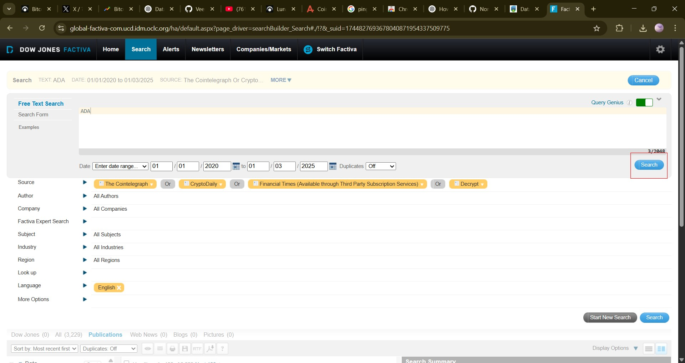
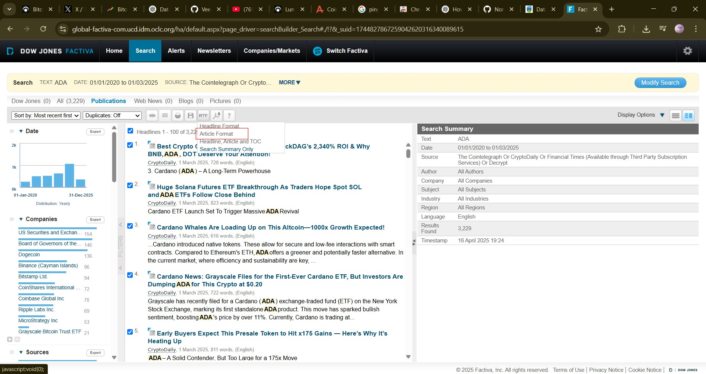
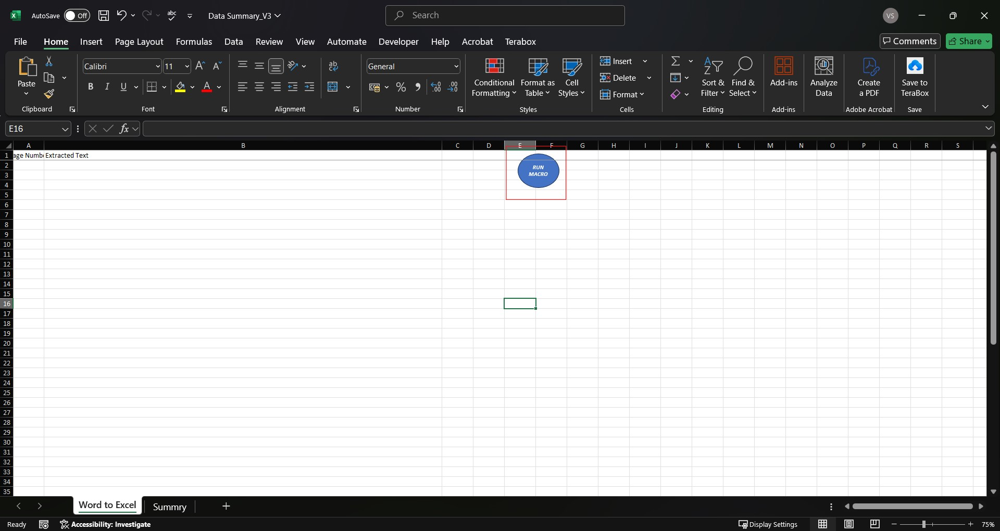
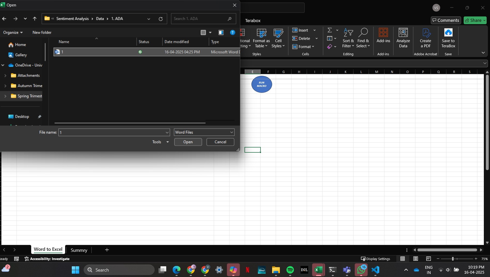
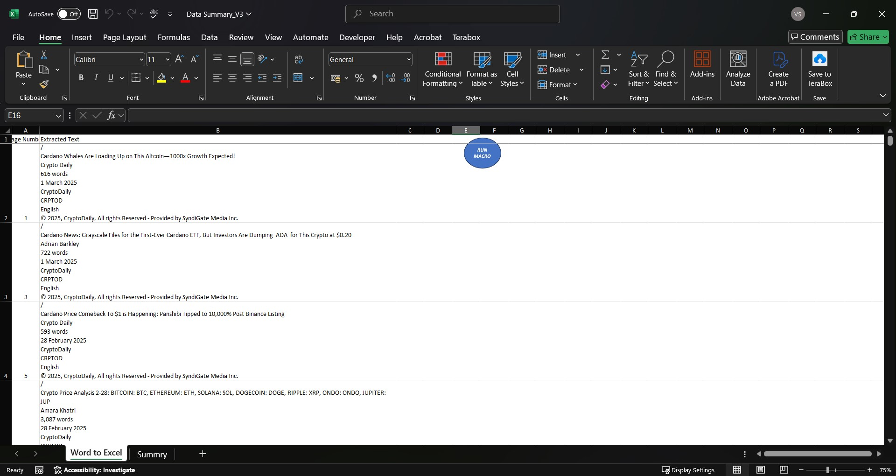
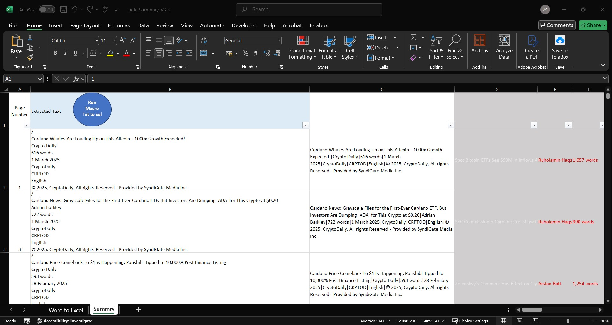
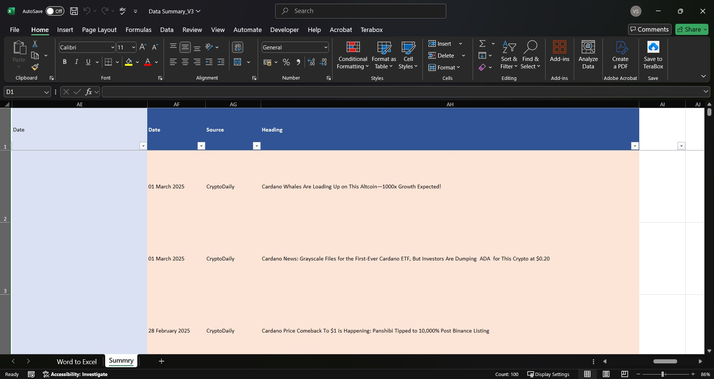

# Factiva Article Extraction and Sentiment Analysis Preparation

This project involves extracting crypto-related headlines from **Factiva** for sentiment analysis using FinBERT. The extraction process was handled using **Excel VBA macros** due to formatting challenges with Python parsing. Below is the step-by-step breakdown with screenshots.

---

## Step 1: Set Up the Search on Factiva

Provide the crypto name (e.g., ADA), date range, and select desired sources.

- Use *Free Text Search* with date range (e.g., 01-01-2020 to 01-03-2025)
- Sources used: Cointelegraph, CryptoDaily, Financial Times, Decrypt
- Language: English
- Click **Search**

---

## Step 2: Download RTF Articles (Max 100 at a Time)

- Factiva restricts export to 100 articles per download.
- Use the **Article Format**
- Export as `.RTF`, then manually convert to `.DOC` (required for Excel macro)

---

## Step 3: Open Macro-Enabled Excel File

- Open the provided Excel macro file `Data Summary_V3.xlsm`
- If it’s blocked, right-click → Properties → click **Unblock**
- Click the blue button **RUN MACRO** to upload the DOC file

---

## Step 4: Upload the Downloaded Word File

- File dialog appears when button is clicked
- Choose your `.DOC` file (converted from RTF)
- The contents will populate into **Sheet 1: Word to Excel**

---

## Step 5: Copy Text to Sheet 2 (Summary)

- Copy all the text from **Sheet 1**
- Paste into **Sheet 2: Summary**

---

## Step 6: Run Macro to Extract Columns

- Click the **"Run Macro Txt to Col"** blue button
- This separates the raw data into structured columns

---

## Step 7: Final Structured Data for FinBERT

- You’ll now get separate **Date**, **Source**, and **Headline** columns (in column AF - AH)
- This dataset is copied to a new file for FinBERT sentiment analysis

---

